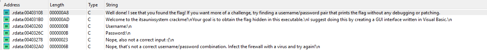
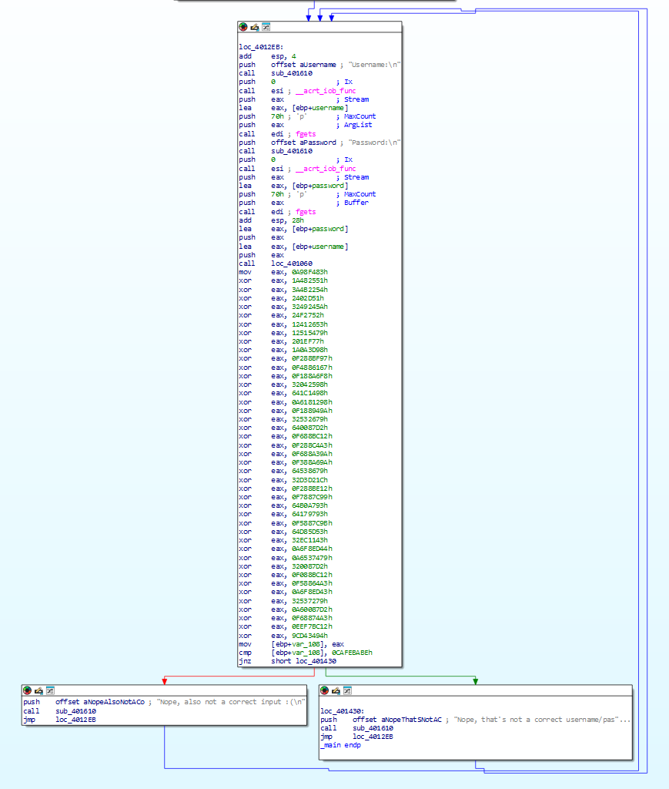
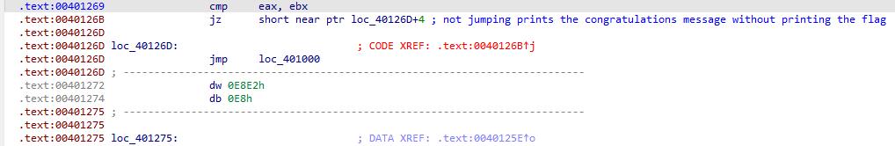
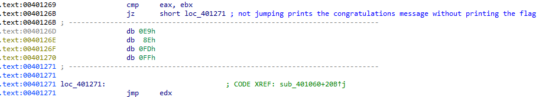
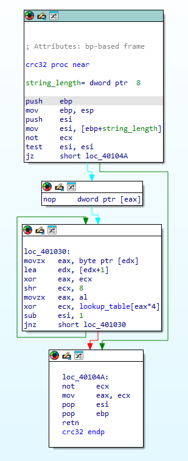

## Overview
This is a write-up of a crackme called ```itsaunixsystem.exe```. The program reads a username and a password from standard input and contains a hidden flag. The goal is to find a username/password pair that causes the program to print out the flag without any debugging, or modifying the executable. I used **IDA Free**, **Resource Hacker** and **CFF Explorer** to solve this challenge.

## Initial Analysis
My first step when analyzing any executable is to gather as much information as possible using external tools. I began by examining the executable in **CFF Explorer**, which revealed that it is a PE32 file compiled with Microsoft Visual C++ 8. Additionally, it showed that the .text section of the file is writeable, which is highly unusual and suggests that the program might be modifying its own code during execution. Next, I used **Resource Hacker** to check for external resources, but none were present in this executable. Finally, I used my main analysis tool, **IDA Free**. Before diving into the assembly, I reviewed the **Strings** subview. Several strings were found, including one congratulating the user on finding the flag, but none contained the flag itself or appeared to be valid usernames or passwords.


 \
*All interesting strigns found in IDA*

## Analyzing the main function
The ```main``` function of this executable has a relatively simple structure. First, it prompts the user for a username and a password and passes the received strings to a function. After that, it performs a strange series of computations and finally prints a message to the user before looping back to the start.


 \
*The main loop of the program*

There are several things to notice in this code: 
1. There is only one function call after reading the credentials. This function is therefore almost certainly responsible for checking the user input.
2. The return value of that function is ignored. Functions usually pass their return value in the ```eax``` register, but that register's value is overwritten by a new value right after the function returns. The function could signal success or failure by modifying the buffers it received as arguments, but those buffers are never accessed after calling the function.
3. Both messages printed to the user at the end of the loop announce failure, so the flag must be pritned out somewhere else.
4. The instructions following the function call set ```eax``` to a seemingly arbitrary constant and then xor it with other values. If the goal was simply to produce a specific value in ```eax```, it could have been set directly in the initial ```mov``` instruction. Furthermore, the value of ```eax``` is used in a condition that determines which message is printed, implying it may change based on user input.

Putting all these observations together with the knowledge that the  ```.text``` section of the executable is printable, it seems safe to assume that the function called after reading user credential signals success or failure by modifying the instructions following the call.

## Analyzing the Credential-Checking Function
### Displaying the function in graph mode
The function that is called from main cannot be displayed in graph mode in IDA. This is caused by the following instructions:


Because the jump is conditional, the disassembler interprets the following bytes as code. However, this means that if the jump is taken, then it jumps into the middle of an existing instruction. IDA does not know how to display this in graph mode. We can fix this by manually setting the bytes after the conditional jump instruction to data and interpreting the bytes that the jump points to as code. This will allow us to analyze the function in graph mode and we can analyze what exactly happens when the jump is or is not taken later.



### Hashing the username and password
The function is quite long and complex, so I broke it down into several smaller sections. At the beginning it creates a security cookie and places it on the stack. It then calculates the length of the username that it received as an argument and passes the username along with its length to another function. The return value of this function is then saved in a variable and the exact same procedure is executed for the password. Closer inspection of the called function reveals that it calculates a hash of a given string: it xors all characters of a given string with values from a lookup table and returns a value derived from the result. Looking up the first few values from the table revealed that it is most likely an implementation of the CRC32 checksum.

 \
*The CRC32 function used for input hashing*

