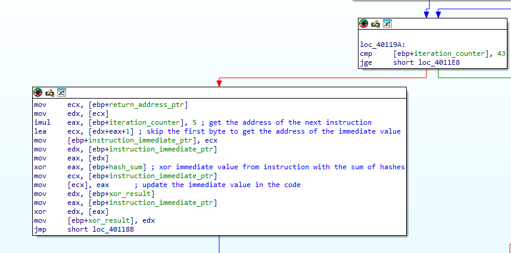
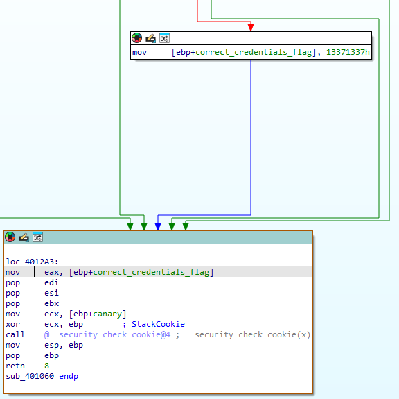
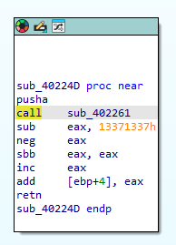
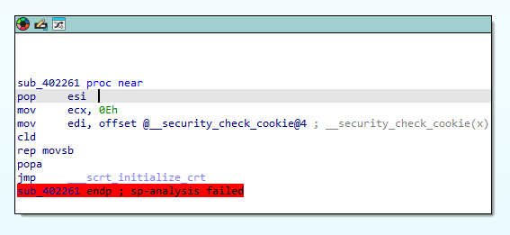

## Table of Contents
- [Overview](#overview)
- [Initial Analysis](#initial-analysis)
- [Analyzing the Main Function](#analyzing-the-main-function)
- [Analyzing the Credential-Checking Function](#analyzing-the-credential-checking-function)
  - [Displaying the Function in Graph Mode](#displaying-the-function-in-graph-mode)
  - [Hashing the Credentials](#hashing-the-credentials)
  - [Decoding Instructions in the Main Function](#decoding-instructions-in-the-main-function)
  - [Using a Prng to Check the Username Hash](#using-a-prng-to-check-the-username-hash)
  - [Printing Out the Flag](#printing-out-the-flag)
- [Finding Valid Credentials](#finding-valid-credentials)
 
## Overview
This is a write-up of a crackme called ```itsaunixsystem.exe```. The program reads a username and a password from standard input and contains a hidden flag. The goal is to find a username/password pair that causes the program to print out the flag without any debugging, or modifying the executable. I used **IDA Free**, **Resource Hacker** and **CFF Explorer** to solve this challenge.

## Initial Analysis
My first step when analyzing any executable is to gather as much information as possible using external tools. I began by examining the executable in **CFF Explorer**, which revealed that it is a PE32 file compiled with Microsoft Visual C++ 8. Additionally, it showed that the .text section of the file is writeable, which is highly unusual and suggests that the program might be modifying its own code during execution. Next, I used **Resource Hacker** to check for external resources, but none were present in this executable. Finally, I used my main analysis tool, **IDA Free**. Before diving into the assembly, I reviewed the **Strings** subview. Several strings were found, including one congratulating the user on finding the flag, but none contained the flag itself or appeared to be valid usernames or passwords.


 \
*All interesting strigns found in IDA*

## Analyzing the Main Function
The ```main``` function of this executable has a relatively simple structure. First, it prompts the user for a username and a password and passes the received strings to a function. After that, it performs a strange series of computations and finally prints a message to the user before looping back to the start.


 \
*The main loop of the program*

There are several things to notice in this code: 
1. There is only one function call after reading the credentials. This function is therefore almost certainly responsible for checking the user input.
2. The return value of that function is ignored. Functions usually pass their return value in the ```eax``` register, but that register's value is overwritten by a new value right after the function returns. The function could signal success or failure by modifying the buffers it received as arguments, but those buffers are never accessed after calling the function.
3. Both messages printed to the user at the end of the loop announce failure, so the flag must be pritned out somewhere else.
4. The instructions following the function call set ```eax``` to a seemingly arbitrary constant and then xor it with other values. If the goal was simply to produce a specific value in ```eax```, it could have been set directly in the initial ```mov``` instruction. Furthermore, the value of ```eax``` is used in a condition that determines which message is printed, implying it may change based on user input.

Putting all these observations together with the knowledge that the  ```.text``` section of the executable is writeable, it seems safe to assume that the function called after reading user credential signals success or failure by modifying the instructions following the call. These instructions are likely decoded into code that prints the flag if the correct username and password are provided.

## Analyzing the Credential-Checking Function
### Displaying the Function in Graph Mode
The function that is called from main cannot be displayed in graph mode in IDA. This is caused by the following instructions:


Because the jump is conditional, the disassembler interprets the following bytes as code. However, this means that if the jump is taken, then it jumps into the middle of an existing instruction. IDA does not know how to display this in graph mode. I fixed this by manually setting the bytes after the conditional jump instruction to data and interpreting the bytes that the jump points to as code.


### Hashing the Credentials
The function is quite long and complex, so I broke it down into several smaller sections. At the beginning it creates a security cookie and places it on the stack. It then calculates the length of the username that it received as an argument and passes the username along with its length to another function. The return value of this function is then saved in a variable and the exact same procedure is executed for the password. Closer inspection of the called function reveals that it calculates a hash of a given string: it xors all characters of the string with values from a lookup table and returns a value derived from the result. Looking up the first few values from the table revealed that it is most likely an implementation of the CRC32 checksum.

 \
*The CRC32 function used for input hashing*

## Decoding Instructions in the Main Function
After hashing the username and password, the sum of these hashes is calculated. What follows is a loop over the strange instructions seen in the ```main``` function. There are two important things to know to understand what exactly is going on in this section of the function:
1. There are 43 instructions following the call to the credential-checking function in ```main```. The first instruction is ```mov eax, immediate_value```, and the next 42 instructions are ```xor eax, immediate_value```.
2. Both of these instructions are 5 bytes long. The first byte is the opcode (```B8``` for ```mov eax``` and ```35``` for ```xor eax```) and the remaining 4 bytes is the immediate value.

The function iterates over all 43 instructions following the function call and calculates a pointer to the immediate value bytes. The immediate value is then xored with the sum of the password and username hashes. Finally a cumulative xor of all these newly computed immediate values is computed, that is

```cumulative_xor = (immediate_1 ^ hash_sum) ^ ... ^ (immediate_43 ^ hash_sum) = (immediate_1 ^ ... ^ immediate_43) ^ hash_sum```

This cummulative xor must be equal to ```0xDEADBEEF```, otherwise the function returns without printing the flag. The xor of all the immediate values is ```0xD0A5DAFC```. I calculated that the sum of the hashes of the username and password must be equal to

```0xD0A5DAFC ^ 0xDEADBEEF = 0x0E086413```

This is the first piece of useful information about the correct credentials.

 \
*The body of the instruction-decoding loop*

### Using a PRNG to Check the Username Hash
If the check on the cumulative xor value is succesfull, the hash of the username is used as a seed for a slightly modified Mersenne Twister prng. The initialization is exactly the same as in the standard MT, but the function that generates pseudo random numbers differs in two used constants. Other than that, the implementation is standard. Three values are generated using the prng and two separate checks are performed. First, if the first two generated values satisfy this equation

```rand1 & rand2 = ((((rand1 & rand2) - rand2) & rand2) - 1) & rand2```

then the program prints the congratulation message without printing the flag. The second check compares each of the generated numbers to a specific value. If the generated values are equal to ```0x45CFB9C4```, ```0x619BB736``` and ```0x11636892``` respectively, then a local variable is set to ```0x13371337```, and this ultimately leads to the flag being printed. It is worth noting that these values do not satisfy the equation mentioned before, so we can ignore that condition when solving the challenge. This gave me the second important piece of information: the hash of the username must lead to these three values being generated when used as a seed to the modified Mersenne Twister.

### Printing Out the Flag
Before using the gathered information to find the correct credentials, I wanted to understand what exactly happens to print the flag. The variable that is set when all three prng values are correct is seemingly never used - the function goes straight to the epilog after setting it.

 \
*The epilog of the credentials-checking function*

I used dynamic analysis to discover that the crucial code is inside the ```@__security_check_cookie@4``` function. The code inside this function is overwritten during startup using the following two functions:

 \
*The function containing the code that is placed inside __security_check_cookie*

 \
*The function copying the code into __security_check_cookie*

The first function contains the code that is copied into the ```@__security_check_cookie@4``` function. The second function is responsible for actually copying the code. The new ```@__security_check_cookie@4``` function checks whether ```eax``` contains ```0x13371337```. If it does, it increments the return address of the function it was called from by 1. This means that when the correct credentials are entered, the immediate values in the main are correctly decoded, and the credentials-checking function does not return to the ```mov eax, immediate``` instruction, but to the decoded immediate value that now contains valid instructions. These instructions dynamically construct the flag and print it out.

## Finding Valid Credentials

At this point there is enough information to solve the challenge.
1. The modified Mersenne Twister must generate ```0x45CFB9C4```, ```0x619BB736``` and ```0x11636892``` as the first three values when seeded by the hash of the username.
2. The sum of the hashes of the username and password must be equal to ```0x0E086413```.

First, I implemented the prng to find the hash of the username. The source code can be seen in ```mersenne_twister.cpp```. I found that only one seed generates the required values, so the hash of the username must be equal to that seed. The value was ```0x95c32a4c```. I used this along with the second condition to determine that the hash of the password must be equal to ```0x784539C7```.
Finally, I implemented the CRC32 hash in ```crc_crack.py``` and broke the hashes. The username is -{x-i and the password is "kms|. The flag is flag{7w0_c0d35_wr1773n_r16h7_0n_70p_0f_34ch_07h3r}.


